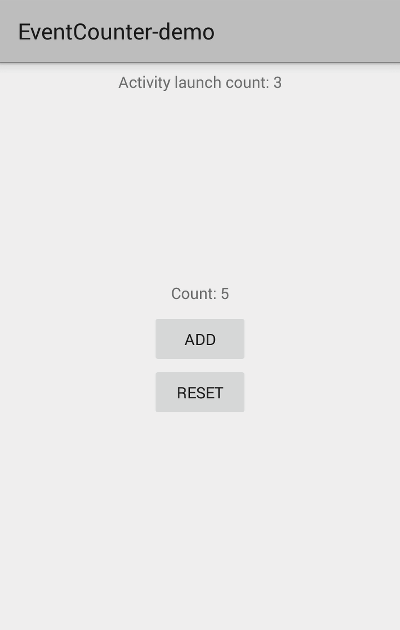

EventCounter
=====


##Importing to your project
Add this dependency to your build.gradle file:
```java
dependencies {
    compile 'com.hrules:eventcounter:1.1.0'
}
```

This lib is easy to use. If you want to create a counter and increase or decrement his value, you only have to write this lines. (Two ways to do that)(The key value is only a id for your counter, use any that you want)

* Create an EventCounter object and manage it:

```java
public static final String KEY_FOR_COUNTER = "KEY";

EventCounter eventCounter = new EventCounter(context);

//Increase value (Default increment 1, add an int param to getKeyValue to set value to increment)
eventCounter.incrementKeyValue(KEY_FOR_COUNTER).getKeyValue(KEY_FOR_COUNTER);
//Decrement value (Default decrement 1, add an int param to getKeyValue to set value to decrement)
eventCounter.decrementKeyValue(KEY_FOR_COUNTER).getKeyValue(KEY_FOR_COUNTER);
//Check value (Adding and int value to compare and a condition, you can get boolean returns comparing your counter)
eventCounter.getKeyValue(KEY_FOR_COUNTER);
eventCounter.getKeyValue(KEY_FOR_COUNTER, 3 , EventCounter.EQUAL_TO);
eventCounter.getKeyValue(KEY_FOR_COUNTER, 4);//default value to return
//Reset counter
eventCounter.resetKeyValue(KEY_FOR_COUNTER);
//Reset all
eventCounter.resetAll();
//Add or remove key
eventCounter.addKey(KEY_FOR_COUNTER);
eventCounter.removeKey(KEY_FOR_COUNTER);
```

* Use it as singleton:

```java
//Increase value
EventCounter.with(context).incrementKeyValue(KEY_FOR_COUNTER).getKeyValue(KEY_FOR_COUNTER);
//Decrement value
EventCounter.with(context).decrementKeyValue(KEY_FOR_COUNTER).getKeyValue(KEY_FOR_COUNTER);
//Check value
EventCounter.with(context).getKeyValue(EVENTCOUNTER_COUNTER):
//Reset counter
EventCounter.with(context).resetKeyValue(EVENTCOUNTER_COUNTER);
```

Readme added by [Mun0n](https://github.com/Mun0n) Nice to meet you! ;-)

Developed by
-------
Héctor de Isidro - hrules6872 [](http://twitter.com/h_rules)

License
-------
    Copyright 2015 Héctor de Isidro - hrules6872

    Licensed under the Apache License, Version 2.0 (the "License");
    you may not use this file except in compliance with the License.
    You may obtain a copy of the License at

       http://www.apache.org/licenses/LICENSE-2.0

    Unless required by applicable law or agreed to in writing, software
    distributed under the License is distributed on an "AS IS" BASIS,
    WITHOUT WARRANTIES OR CONDITIONS OF ANY KIND, either express or implied.
    See the License for the specific language governing permissions and
    limitations under the License.
